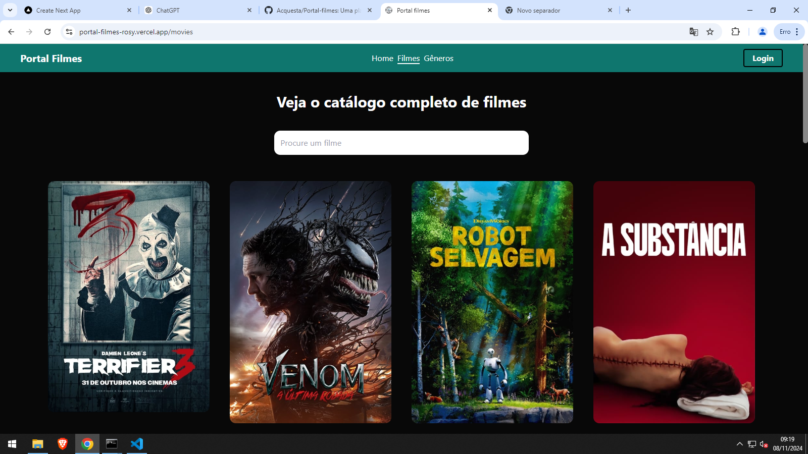

# Movie Watchlist 🎬

Este é um projeto em React que utiliza a API The Movie Database (TMDb) para exibir informações sobre filmes, além de permitir ao usuário salvar filmes assistidos e filmes para ver depois, utilizando armazenamento local.

## Funcionalidades

- **Requisições de Filmes:** O projeto faz requisições para a API TMDb para obter informações de filmes como títulos, descrições e imagens.
- **Armazenamento Local:** Os usuários podem marcar filmes como "assistidos" ou "para ver depois", que são salvos no localStorage do navegador.
- **Rotas Dinâmicas:** O projeto utiliza o `react-router-dom` para gerenciar rotas dinâmicas e navegação entre diferentes páginas.
- **Interface Intuitiva:** A interface foi estilizada com `Tailwind CSS` para garantir um design responsivo e agradável.
- **Ícones:** Utilização da biblioteca `HeroIcons` para adicionar ícones de fácil visualização na interface.

## Tecnologias Utilizadas

- **React:** Biblioteca JavaScript para construir interfaces de usuário.
- **Tailwind CSS:** Biblioteca de CSS utilitária para estilização rápida e responsiva.
- **React Router DOM:** Gerenciamento de rotas dinâmicas no React.
- **HeroIcons:** Ícones otimizados para Tailwind CSS.
- **LocalStorage:** Armazenamento de dados no navegador para salvar informações dos filmes.
